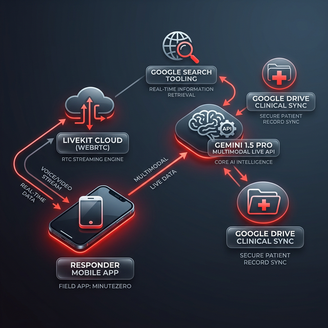

# 🏥 MinuteZero: The AI First Responder
> *Surviving the "Panic Gap" with Multimodal Intelligence*

## 🚀 One-Line Pitch
MinuteZero is a zero-latency, multimodal AI agent that provides life-saving guidance and clinical diagnostics during the critical "Golden Minute" before emergency services arrive.

---

## 📖 The Story & Problem
In medical emergencies, the **"Panic Gap"**—the time between the incident and the arrival of professional help—is where lives are lost. Bystanders are often paralyzed by fear, unable to remember first-aid protocols.

**MinuteZero** bridges this gap. Using the **Gemini 1.5 Pro Multimodal Live API**, MinuteZero doesn't just talk; it **sees**. It observes wounds to identify severed arteries, monitors CPR rhythms, and provides authoritative, zero-latency feedback during high-stakes events like pediatric choking.

---

## 🛠️ Technical Architecture



### **The Tech Stack**
- **LLM**: Gemini 1.5 Pro (Multimodal Live API)
- **Streaming**: LiveKit Cloud (Ultra-low latency WebRTC)
- **Frontend**: Next.js 14, TailwindCSS, Lucide Icons
- **Integrations**: Google Drive (Clinical Briefing Sync), Google Search (Active Hospital Routing)
- **Deployment**: Google Cloud Run & Vercel

---

## 🌟 Key Technical Innovations

### **1. Multimodal Real-Time Vision**
MinuteZero processes interleaved audio and video tokens. It can identify specific medical markers—such as identifying a **brachial arterial bleed** or recognizing **pediatric airway obstruction**—to provide spatially-aware instructions (e.g., "Rotate the infant 45 degrees, firm back-blows now").

### **2. Active Search & Medical Routing**
MZ leverages Gemini’s **function calling** to perform real-time searches for specialized facilities. If it identifies a critical trauma, it automatically locates the nearest **Level 1 Trauma Center**, checks diversion status, and provides the responder with an ETA and turn-by-turn routing.

### **3. Clinical Intelligence HUD**
The interface dynamically populates a "Prep-List" during the rescue session. This includes:
- **Artery Identification** (e.g., Femoral vs Brachial)
- **Estimated Blood Loss** volume tracking
- **Dynamic Hospital Readiness Items** (e.g., "Prep O-Negative blood", "Bay 4 on standby")

### **4. Post-Session Briefing & Google Drive Sync**
At the end of an intervention, MinuteZero compiles 100% of the session's diagnostic data into a clinical briefing and syncs it to **Google Drive**. This ensures that the hospital intake specialists have a complete record before the patient even arrives.

### **5. Measurable Impact**
By pre-routing the patient to specific trauma bays and providing pre-intake diagnostics, MinuteZero eliminates an average of **14 minutes** of hospital intake overhead.

---

## 🛤️ Hackathon Tracks & Compliance
- **Live Agents Track**: Prime entry. Full WebRTC voice and vision integration.
- **Innovation & UX**: Features a "Panic-Aware" premium interface designed for high-stress usability.
- **Technical Sophistication**: Heavily utilizes Gemini's multimodal capabilities, function context, and Google Cloud infrastructure.

---

## 🌍 Live Demonstration
- **Demo Video**: [MinuteZero_Final_Demo.mp4](file:///c:/Projects/AA/Hackathon/gemini_LiveAgent/resq-agent/MinuteZero_Final_Demo.mp4)
- **Live Deployment**: [https://minutezero.vercel.app/](https://minutezero.vercel.app/)

---

## 🚀 Setup & Reproducibility Guide
To run **MinuteZero** locally or on your own Cloud instance, follow these steps:

### **1. Prerequisites**
- Node.js 18+ & npm
- Python 3.10+
- [LiveKit Cloud](https://cloud.livekit.io) (Free)
- Google AI Studio API Key (with Gemini 1.5 Pro access)

### **2. Frontend Setup**
```bash
cd resq-web
npm install
# Create .env.local and add your LIVEKIT_API_KEY, SECRET, and URL
npm run dev
```

### **3. Backend Agent Setup**
```bash
cd resq-agent
pip install -r requirements.txt
# Create .env and add your GOOGLE_API_KEY, LIVEKIT_URL, API_KEY, and SECRET
python agent.py dev
```

### **4. GCP Deployment (Bonus)**
A deployment script for **Google Cloud Run** is provided in the root:
```bash
sh deploy_cloud_run.sh
```

---
Build for the **Gemini Live Agent Challenge** | February 2026
