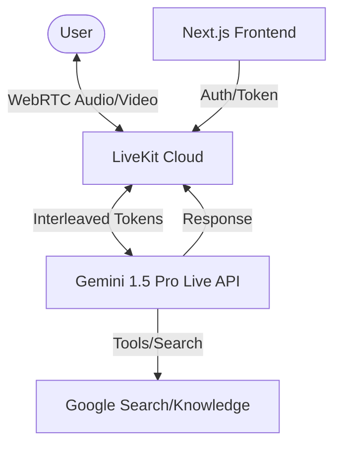

# MinuteZero: The AI First Responder

## 🚀 One-Line Pitch
MinuteZero closes the "Panic Gap"—the critical minutes between an emergency and the arrival of professional help—using real-time multimodal AI.

## 📖 The Story
In a medical emergency, every second counts. Whether it's a cardiac arrest, severe bleeding, or a choking incident, the minutes spent waiting for an ambulance are often the difference between life and death. During these moments, bystanders are often paralyzed by panic, unsure of what to do, or afraid of making a mistake.

**MinuteZero** (formerly VitalSignal) is a real-time, multimodal AI agent designed to bridge this "Panic Gap." Unlike traditional telehealth which requires queuing and high bandwidth, MinuteZero provides **zero-latency, always-on guidance**. 

Using the **Gemini 1.5 Pro Multimodal Live API**, MinuteZero doesn't just talk—it **sees**. It can observe a wound to guide pressure application, count the rhythm of CPR compressions in real-time, and detect environmental hazards, all while maintaining a calm, authoritative voice to keep the user focused and composed.

## 🛠️ How it Works (Technical Architecture)

- **Frontend**: A high-performance **Next.js** application designed for mobile-first, one-tap access.
- **Real-Time Streaming**: Powered by **LiveKit**, providing ultra-low latency WebRTC streams for audio and video.
- **Intelligence**: The core is the **Gemini 1.5 Pro Live API** integrated via the LiveKit Google Plugin.
- **Multimodality**: The agent processes interleaved audio/video tokens, allowing it to provide verbal instructions synchronized with what it sees through the user's camera.
- **Protocol Engine**: A specialized system prompt ensures strict adherence to Red Cross and AHA medical protocols.

## 🎨 Design Aesthetics
MinuteZero features a "Premium Emergency" aesthetic—dark mode for high contrast, vibrant "Life Red" accents for visibility, and fluid glassmorphic components. It uses micro-animations and audio visualizers to provide constant feedback that the "Agent is watching and listening."

## 🌟 Key Features
- **One-Tap Rapid Protocols**: Instant categorization for "Heavy Bleeding", "No Respiration", etc., skipping the intake phase for mid-protocol guidance.
- **Visual Wound Assessment**: "I see the bleeding on the left arm. Apply pressure exactly where I'm highlighting on your screen."
- **CPR Rhythm Coach**: Real-time audio-visual beat matching for chest compressions.
- **Panic Reduction Voice**: Calm, directive speech synthesis designed to lower user cortisol levels.
- **Infinite Scalability**: Built to handle mass casualty events where emergency lines might be jammed.

## 🛤️ Challenge Tracks
- **Live Agents**: Core category. Real-time voice/vision interaction.
- **Creative Storyteller**: Using Gemini to narrate and guide through complex, high-pressure human stories.

## 🌍 Live Deployment
Experience MinuteZero live at: **[https://minutezero.vercel.app/](https://minutezero.vercel.app/)**

---
Build with ❤️ for the Gemini Live Agent Challenge.
